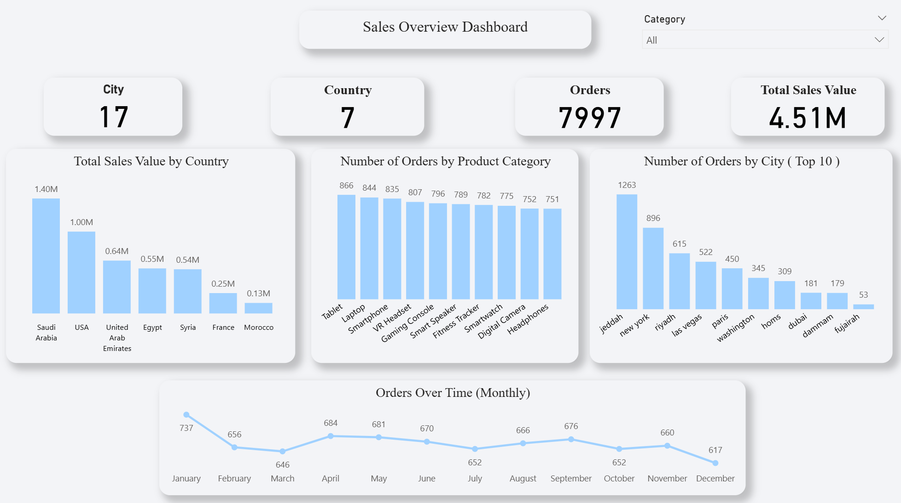

# 📊 Sales Overview Dashboard — Power BI

## Dashboard Preview

## Overview
An interactive sales dashboard built with Power BI analyzing 7,997 orders
across 7 countries and 17 cities with a total sales value of 4.51M.

## Key Insights
- 🇸🇦 Saudi Arabia leads in sales with 1.40M, followed by USA with 1.00M
- 📦 Tablets are the top-selling category with 866 orders
- 🏙️ Jeddah is the highest ordering city with 1,263 orders
- 📅 January had the highest monthly orders (737), December the lowest (617)

## Tools Used
- Power BI — Dashboard & Visualization
- Excel / CSV — Data Source

## Files
| File | Description |
|------|-------------|
| `dashboard.png` | Dashboard screenshot |
| `Orders.csv` | Raw data used for analysis |
| `Sales-Dashboard.pbix` | Power BI file |
